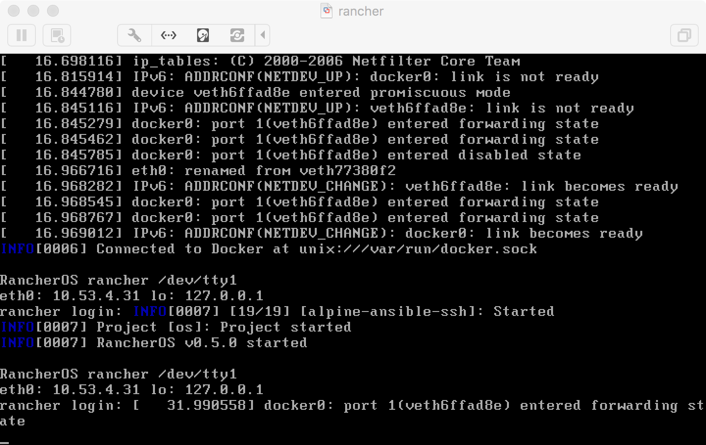

#### Why?

The goal of this project is to create the smallest virtual machine image to be distributed
and consumed easily to team around the world.

##### First...smallest

The qcow2 and vmdk produced from Packer as you can see below are very small.  The vmdk only weighs in a 44 MB.

```bash
> $ ls -alh
total 101M
drwxr-xr-x. 2 root root 4.0K Jul  7 17:16 .
drwxr-xr-x. 4 root root 4.0K Jul  7 17:14 ..
-rwxr-xr-x. 1 root root  58M Jul  7 17:16 packer-rancher-scsi-e1000
-rw-r--r--. 1 root root  121 Jul  7 17:16 rancher.mf
-rw-r--r--. 1 root root 3.0K Jul  7 17:16 rancher.ovf
-rw-r--r--. 1 root root  44M Jul  7 17:16 rancher.vmdk
```

After the instance has been deployed and started the Docker image will be pulled down from the Docker hub.  Currently the image with Ansible and OpenSSH consumes approximately 101MB.

```bash
docker.io/jcpowermac/alpine-ansible-ssh   latest              bab5b26e13f1        7 days ago          101.9 MB
```

##### Second...easy to consume

With VMware used extensively most administrators have previously deployed and used virtual appliances, so RancherOS is packaged as one.  Using the traditional VMware tools via VMware vSphere vCenter, Fusion, Workstation or player the instance can be available in seconds.



```bash
> $ ssh -p2222 ansible@10.53.4.31
The authenticity of host '[10.53.4.31]:2222 ([10.53.4.31]:2222)' can't be established.
ECDSA key fingerprint is SHA256:ljTKsWKfEIZX2tqKYWH4JcDhJEmyKVIHW7n5y/hSXRU.
ECDSA key fingerprint is MD5:f3:88:a2:45:4a:19:8f:67:2d:cd:ef:76:d4:0a:d4:61.
Are you sure you want to continue connecting (yes/no)? yes
Warning: Permanently added '[10.53.4.31]:2222' (ECDSA) to the list of known hosts.
Welcome to Alpine!

The Alpine Wiki contains a large amount of how-to guides and general
information about administrating Alpine systems.
See <http://wiki.alpinelinux.org>.

You can setup the system with the command: setup-alpine

You may change this message by editing /etc/motd.

67c56321308c:~$ ansible-playbook --version
ansible-playbook 2.1.0.0
  config file =
  configured module search path = Default w/o overrides
67c56321308c:~$
```

[Next](02_packer_image.md)
